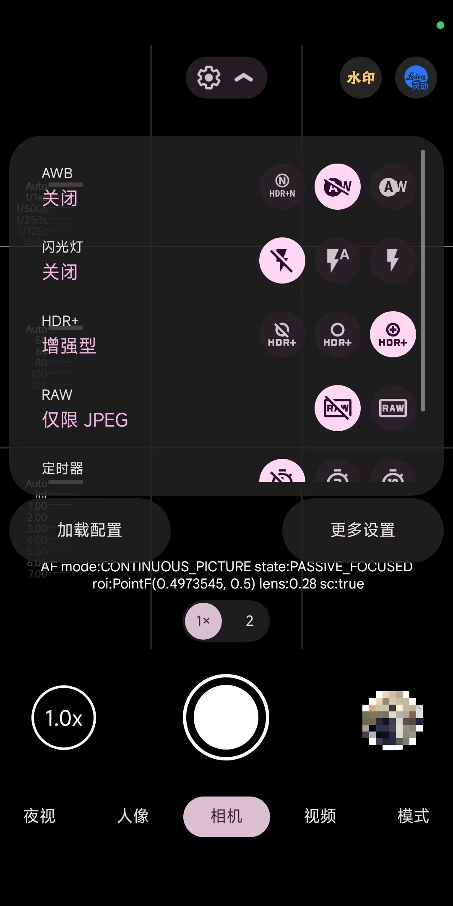

你不需要知道什么叫“算法库”、“多帧合成”，你只需要会：下载 → 安装 → 移动文件 → 点几下。
本教程综合了酷安大佬们的经验，感谢他们。

---

# 一、谷歌相机是什么？我为什么要装它？

简单说，谷歌相机是 Google Pixel 手机上的相机软件，里面有一套很聪明的拍照算法。
它能让你的手机白天拍得更清晰、晚上拍得更亮更干净，尤其是细节比自带相机好一大截。
很多安卓手机（小米、一加、OPPO、三星等）装上它之后，拍照水平能“免费升级”。

缺点也有：**拍照比自带相机慢一点**。但瑕不掩瑜。

---

# 二、下载什么？从哪里下？

你需要下载两样东西：安装包（apk） + 配置文件（.agc）。

## 2.1 下载安装包（AGC相机）

AGC 是其中一个谷歌相机改版（作者 BigKaka）。它有多个版本：8.4、9.2、9.3 等。
不同的手机可能需要不同的版本，比如：

- 我的小米手机装 AGC 8.4 很稳定
- 我的另一部一加手机装 AGC 9.2 才正常

所以原则是：哪个版本不闪退、能加载配置，就用哪个。

*首先推荐你去[酷安](https://www.coolapk.com/)搜索自己的机型（如REDMI K80 至尊版）进入机型对应板块，再搜索“谷歌相机”，有很多大佬分享的谷歌相机安装包和配置文件推荐*

推荐你先尝试 AGC 9.2.14，因为新算法更好用。

AGC 9.2.14 下载地址（ 收集了BigKaka大佬改版 ）：
 👉 [点击跳转](https://www.celsoazevedo.com/files/android/google-camera/dev-BigKaka/f/dl80/) 

> 如果你还想找其他版本（8.4、9.1、9.3…），可以访问：👉 [点击跳转](https://www.celsoazevedo.com/files/android/google-camera/Bigkaka)
>
>里面有各种版本，挑一个下载。

注意：下载时看清楚 apk 的名字。有些带 _snap.apk、_aweme.apk、_ruler.apk 等后缀，这代表不同的“包名”。
- 不同品牌手机可能需要特定包名，见下表（以9.2.14为例）：

| 手机品牌  | 优先下载这个后缀的apk                      | 特征                |
| ----- | --------------------------------- | ----------------- |
| 小米/红米 | AGC9.2.14_V14.0.apk （通用）          | 包名是com.agc.gcam92 |
| 一加    | AGC9.2.14_V14.0_snap/aweme.apk    | 带snap/aweme       |
| 黑厂通用  | AGC9.2.14_V14.0_aweme.apk         | 带aweme            |
| 三星    | AGC9.2.14_V14.0_ruler/samsung.apk | 带ruler/samsung    |
| 其它    | 先试一下通用的                           | --                |

## 2.2 下载配置文件（.agc 文件）

配置文件就像“滤镜+参数的懒人包”，加载后你的谷歌相机就自动调好了，不用自己慢慢调。

- 通用配置下载地址（包含多个机型的配置）：
    - 👉 [123Pan](https://www.123pan.com/s/8hrKVv-lGHyv.html)
- · 我还收集了一些配置文件，你也可以试试：
    - 👉 [123Pan](https://1852597487.share.123865.com/123pan/r4Bwvd-oEMTH)

下载后你会得到一堆 **.agc** 的文件。先不用管它们叫什么，接下来教你放对位置。

---

# 三、安装和配置（一步步来）

## 第一步：安装 apk

1. 把下载好的 .apk 文件安装到手机上。
    - **如果后缀有数字（比如 .apk.1），先重命名删掉数字，只保留 .apk。**
2. 安装完成后先不要打开！直接去下一步。

## 第二步：创建文件夹并放入配置文件

这一步很多人错，仔细看。

打开你手机的“**文件管理器**”，找到 `内部存储 → Download` 文件夹。

· 如果你装的是 AGC 9.2 或更高版本（9.2、9.3…）：
  · 在 Download 文件夹下创建一个叫 AGC.9.2 的文件夹。
  · 再在这个文件夹里创建一个叫 configs 的文件夹。
  · 最终路径：/Download/AGC.9.2/configs/
  · 把你下载的所有 .agc 配置文件 复制或移动 到这个 configs 文件夹里。
· 如果你装的是 AGC 8.4 版本：
  · 直接把下载好的 AGC.8.4 文件夹（可能解压后就有）整个移动到 Download 目录下。
  · 如果只有单个配置文件，就在 Download 下手动建 AGC.8.4/configs/。

小窍门：不确定版本？安装后在桌面找到它的图标，点长按 → 应用信息，会显示版本号，或者去找你的安装包上面可能写有。

## 第三步：打开谷歌相机并加载配置

1. 现在可以打开谷歌相机了，弹出权限时全部点“允许”（相机、存储、位置）。
2. 进入取景界面后，找到并点击 **三条横线** 或 **齿轮旁边的小箭头** 或 **齿轮**。

8.4版本为例：
1. 选择 「加载配置」。
2. 你会看到刚才放进 configs 里的文件名列表，随便点一个你喜欢的（一般名字里带你的机型或“通用”的比较好）。
3. 点击 「加载」，然后相机可能会提示“需要重启才能生效”。
      直接手动关闭谷歌相机，再重新打开。

---

# 四、常用功能

## 4.1 水印开关（让你的照片带徕卡/相框水印）

- 取景界面右上角有一个水印图标，点一下亮起 → 拍照就有水印。
- 修改水印 → 进入「更多设置」→「水印」，可以图标、甚至自定义你的名字。

## 4.2 换滤镜（拍出不同的味道）

- 取景界面右上角还有一个滤镜图标（通常是徕卡图标），点一下会弹出滤镜列表。
- 比如：徕卡柔和（拍人像）、徕卡生动（风景）、至纯黑白（扫街）。随便点，实时预览。

## 4.3 有时候想拍快一点？

- 顶部菜单把 HDR+ 改成 HDR+（非增强） 或者直接关掉，拍照速度会快很多，但画质会弱一点。

---

# 五、常见问题

Q：加载配置时找不到任何文件？

A：说明配置文件没放对地方。检查：

- 版本号对不对？9.2的配置不能给8.4用。
- 路径是不是 Download/AGC.9.2/configs/？注意大小写
- 放进去后重启一下相机再试。

Q：打开相机就闪退/黑屏？

A：换个包名版本试试。比如你之前装的是通用版闪退，换成 _snap.apk 或 _aweme.apk 再装一次。

Q：拍照转圈很久，点一下要等几秒？

A：很正常！谷歌相机就是慢工出细活。想快一点就把 HDR+ 模式改成“HDR+（普通）”或关闭。

Q：拍完照片很暗或很亮？

A：换一个配置文件。不同大佬做的配置风格不同，多下几个 .agc 试到你满意为止。

Q：变焦后照片模糊？

A：谷歌相机对光学变焦支持不好。尽量用 1x、2x 这些默认焦段，拉太远的话用自带相机更稳。

---

# 六、总结一下

1. 下载：去 celsoazevedo 找到 BigKaka 的 AGC，选你手机合适的包名版本。
2. 下载配置：从上面的 123 云盘链接下载 .agc 文件。
3. 放置：放到 Download/AGC.9.2/configs/ 里（根据你的版本改数字）。
4. 加载：打开相机 → 左上角菜单 → 加载配置 → 选一个 → 重启。
5. 开拍：右上角玩水印和滤镜。

最后一句真心话：谷歌相机不是神，但如果你愿意花10分钟折腾，它会回报你肉眼可见的画质提升。
如果遇到问题，去[酷安](https://www.coolapk.com/)搜你自己手机型号，进入对应板块后搜“谷歌相机”，那里有很多同机型的人帮你，也有很多谷歌相机安装包和配置分享。

祝你拍出好照片！

---
~~由于本人拍照技术太差，故不提供样图（（（~~

